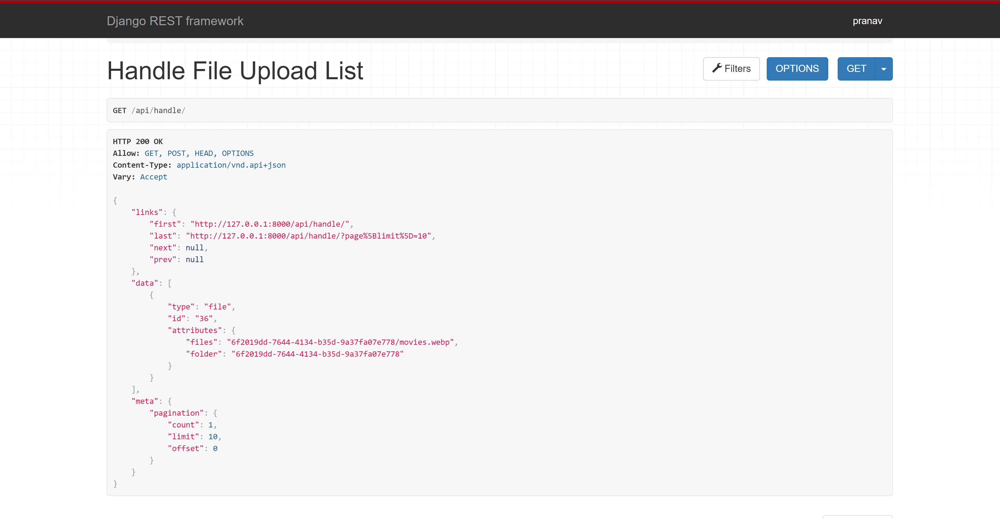
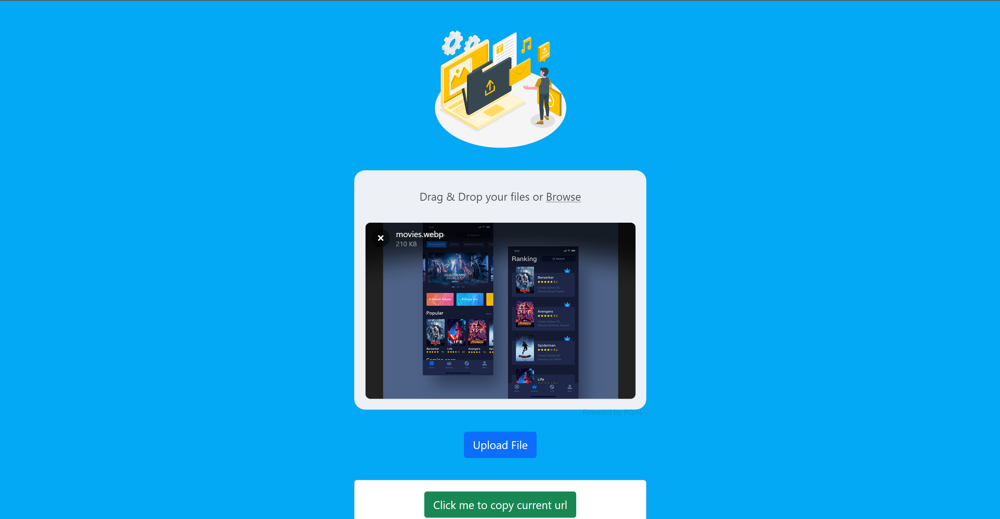
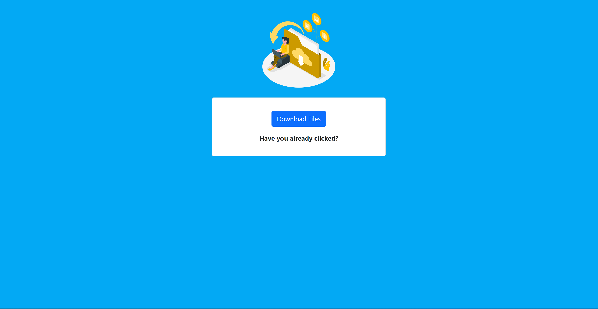

# FileShare

Django rest framework file sharing project. 

# Technologies Used:
- Python
- Django-rest-framework
- Bootstrap
- JavaScript
- filepond

# Usage :

    python django_web_app/manage.py makemigrations

    python django_web_app/manage.py migrate

    python django_web_app/manage.py runserver
    
   In your web browser enter the address : http://localhost:8000 or http://127.0.0.1:8000/

# Screenshots : 

